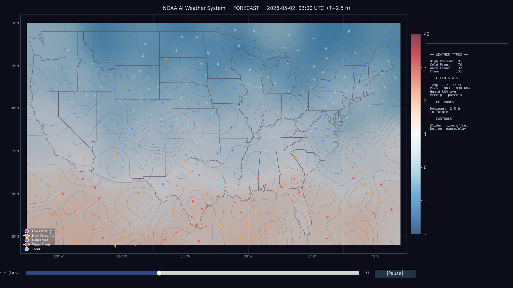

# NOAASIM

A real-time weather simulation and visualization system for the continental United States, powered by live NOAA data, fluid boid dynamics, and Fourier-based prediction.



---

## Concept

Weather systems are not random — they are groupings that move together, push against each other, and follow predictable periodic patterns. NOAASIM models this in two layers:

**Fourier Transform (FFT)** — Each weather parcel carries a 2-year synthetic history of temperature, pressure, wind, humidity, and precipitation at its location. FFT decomposes these time series into dominant frequency components (daily cycles, seasonal shifts, jet-stream oscillations). Extrapolating the phase of those components forward gives a deterministic "backbone" prediction — where the weather *statistically wants to be* at any future time.

**Boids Algorithm** — Each parcel is a boid that interacts with its neighbors using rules adapted from weather physics:
- **Alignment** → wind fronts propagate coherently (neighboring parcels align velocities)
- **Cohesion** → air masses converge toward low-pressure centers
- **Separation** → divergence away from high-pressure systems
- **Pressure gradient** → parcels flow down the local pressure gradient
- **Coriolis** → Northern Hemisphere right-hand deflection by latitude
- **Terrain blocking** → Gaussian orographic bumps (Rockies, Cascades, Appalachians, etc.)

The FFT prediction acts as a soft attractor force on each boid, pulling its state toward the statistically likely future. The boid interactions handle the chaotic spatial dynamics — how systems collide, merge, and propagate — that the FFT alone cannot capture.

---

## Features

- **Live NOAA data** — Fetches current conditions from `api.weather.gov` (no API key required) across 35 seed stations, injected into the swarm in a background thread while the window is already open
- **350 fluid weather parcels** — Each arrow on the map is a boid carrying its own weather state, pointing in the direction of the wind force acting on it
- **5 weather types** — Low pressure (purple), High pressure (orange), Cold front (blue), Warm front (red), Clear (light blue)
- **Temperature heatmap** — Smooth interpolated field showing the spatial temperature gradient
- **Pressure isobars** — Contour lines updated every 3 frames
- **Precipitation overlay** — Blue wash appears where precipitation parcels are present
- **Boid trails** — Faint streaks showing recent parcel paths, rendered as a single `LineCollection` for performance
- **72-hour FFT forecast** — Simulation steps forward in time beyond current conditions
- **Pause / Play** — Freezes the animation timer completely
- **Time slider** — Scrub through the forecast window

---

## Architecture

```
NOAASIM/
├── main.py                   Entry point, CLI flags, startup sequence
├── config.py                 All tunable parameters
├── requirements.txt
├── data/
│   ├── noaa_client.py        NOAA api.weather.gov client (parallel fetch)
│   └── synthetic.py          2-year synthetic climatology generator per lat/lon
├── analysis/
│   └── fourier.py            WeatherFFT (per-boid) + SpatialPressureFFT (2D field)
├── simulation/
│   └── boids.py              WeatherSwarm, WeatherBoid, vectorised physics step
└── visualization/
    ├── map_base.py           US states GeoJSON → matplotlib patches
    └── renderer.py           FuncAnimation, all rendering layers
```

---

## Installation

```bash
git clone https://github.com/PlutoStrange2112/NOAASIM.git
cd NOAASIM
pip install -r requirements.txt
```

**Requirements:** Python 3.10+, numpy, scipy, matplotlib, requests, pandas, shapely, pillow

---

## Usage

```bash
# Default — window opens immediately, NOAA data loads in background
python main.py

# Fully offline, synthetic data only
python main.py --no-api

# Override boid count
python main.py --boids 500

# Use 730-day FFT history for richer frequency analysis (slower startup)
python main.py --full-history
```

On first run the US states GeoJSON boundary file is downloaded and cached in `cache/`.

---

## How FFT + Boids Work Together

```
Historical time series (per boid location)
        │
        ▼
   FFT analysis
        │
   Dominant frequency modes
   (daily, seasonal, jet-stream oscillations)
        │
        ├──► FFT attractor force ──► nudges boid state toward predicted ambient
        │
        └──► Boid interactions
                  ├── Alignment  (front coherence)
                  ├── Cohesion   (convergence at lows)
                  ├── Separation (divergence at highs)
                  ├── Pressure gradient
                  ├── Coriolis
                  └── Terrain blocking
                          │
                          ▼
                  Fluid parcel movement
                  across the USA map
```

The FFT gives the **temporal backbone** — the predictable, periodic part of weather. The boids give the **spatial dynamics** — how weather masses interact as they move. Together they produce a simulation where systems form, propagate, and dissipate in physically plausible ways.

---

## Performance

| Component | Naive | Optimised | Method |
|---|---|---|---|
| Trail rendering | 1104 ms | ~2 ms | `LineCollection` replaces 8,750 `ax.plot()` calls |
| Boid physics | 27 ms | ~5 ms | Fully vectorised numpy (N×N matrix ops) |
| Field interpolation | 18 ms | ~8 ms | `nearest` + `gaussian_filter` vs `linear` + fallback |
| Pressure contours | every frame | every 3 frames | Throttled update |
| **Total** | **>1100 ms** | **~35 ms** | **~29 FPS** |

---

## Data Sources

- **Current observations** — [NOAA National Weather Service API](https://www.weather.gov/documentation/services-web-api) (`api.weather.gov`) — free, no key required
- **Synthetic history** — Climatologically-parameterised autoregressive model (latitude/longitude-dependent temperature normals, prevailing winds, pressure oscillations, correlated noise)
- **US state boundaries** — [PublicaMundi MappingAPI](https://github.com/PublicaMundi/MappingAPI) GeoJSON (public domain, cached on first run)

---

## License

MIT
